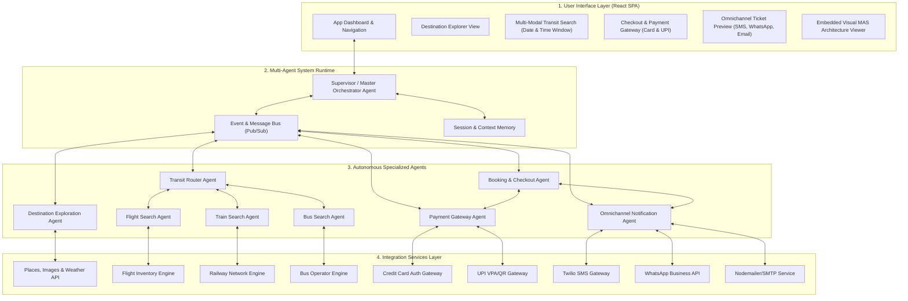
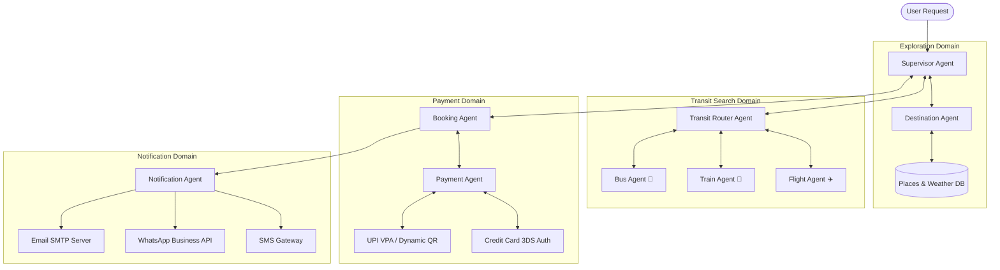
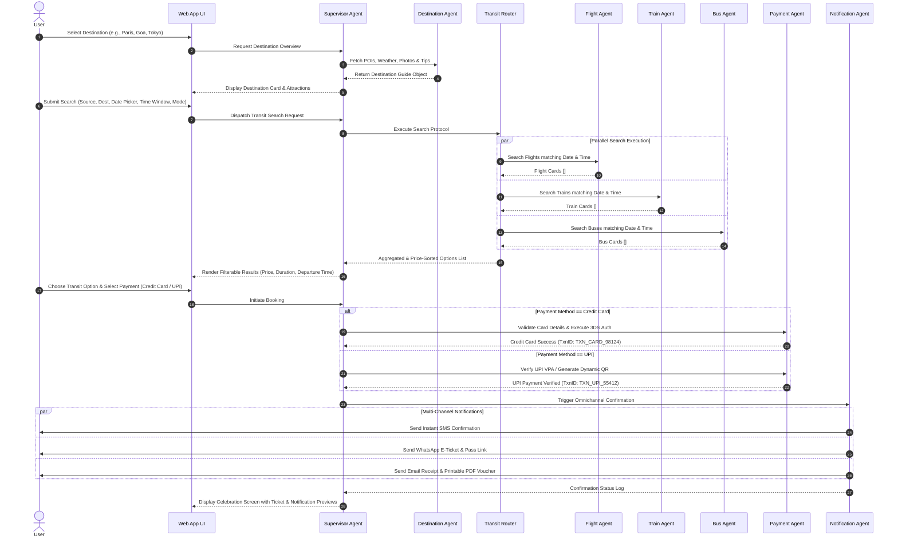
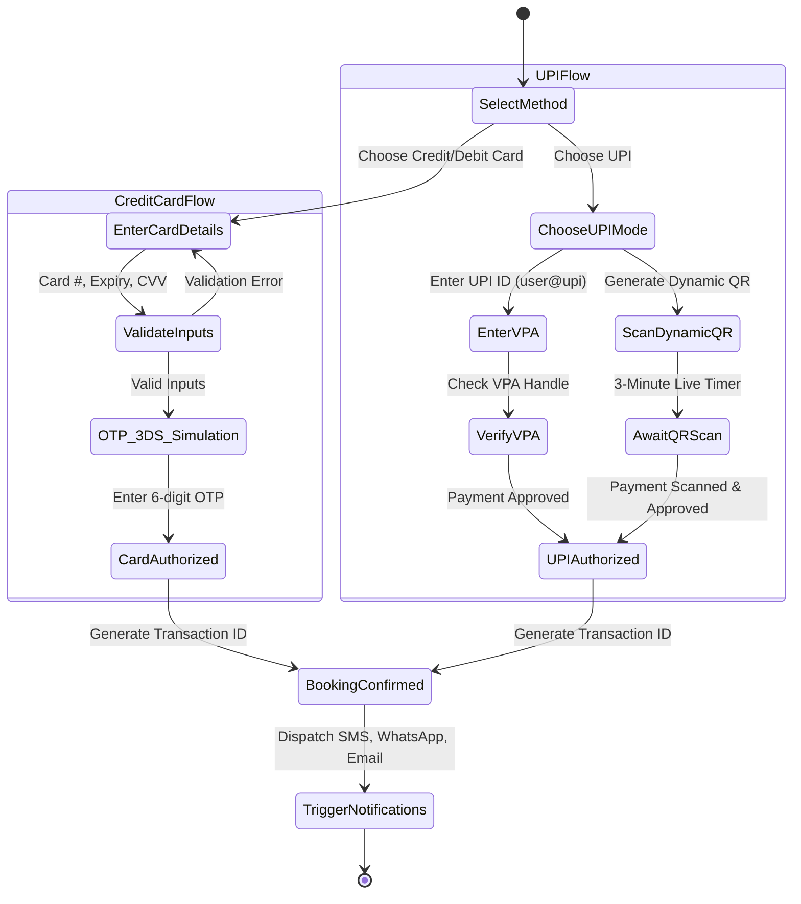

# MyTravelAgent: System Architecture & Block Diagrams

This document contains the complete block diagrams, multi-agent frameworks, sequence flows, and state machine diagrams for **MyTravelAgent**.

---

## 1. High-Level System Block Diagram

---

## 2. Multi-Agent Framework & Interaction Diagram

---

## 3. End-to-End Sequence Diagram (Search -> Payment -> Multi-Channel Dispatch)

---

## 4. Payment Gateway State Machine Diagram

---

## 5. Agent Responsibilities & Data Contract Summary

| Agent Name | Input Schema | Core Operation | Output Schema |
| :--- | :--- | :--- | :--- |
| **Supervisor Agent** | User UI Action | Orchestrates intent, delegates to domain agents, maintains session state. | Updated Application State |
| **Destination Agent** | `{ destinationName: string }` | Queries weather, POIs, travel tips, and hero imagery. | `DestinationProfile` |
| **Transit Router Agent** | `{ source, destination, date, timeWindow, mode }` | Dispatches query to Flight, Train, Bus sub-agents & merges results. | `TransitOption[]` |
| **Flight Agent** | Route, Date, Time Window | Queries flight inventory (airlines, schedules, cabin classes). | `FlightOption[]` |
| **Train Agent** | Route, Date, Time Window | Queries rail timetables (trains, coaches 1A/2A/3A/SL, seats). | `TrainOption[]` |
| **Bus Agent** | Route, Date, Time Window | Queries bus operators (seater/sleeper, boarding points). | `BusOption[]` |
| **Payment Agent** | `PaymentDetails` (Card or UPI) | Validates credentials, executes 3DS / UPI QR check. | `TransactionResult` |
| **Notification Agent** | `BookingTransaction` | Formats e-tickets and dispatches SMS, WhatsApp, Email. | `DeliveryReceipts` |
