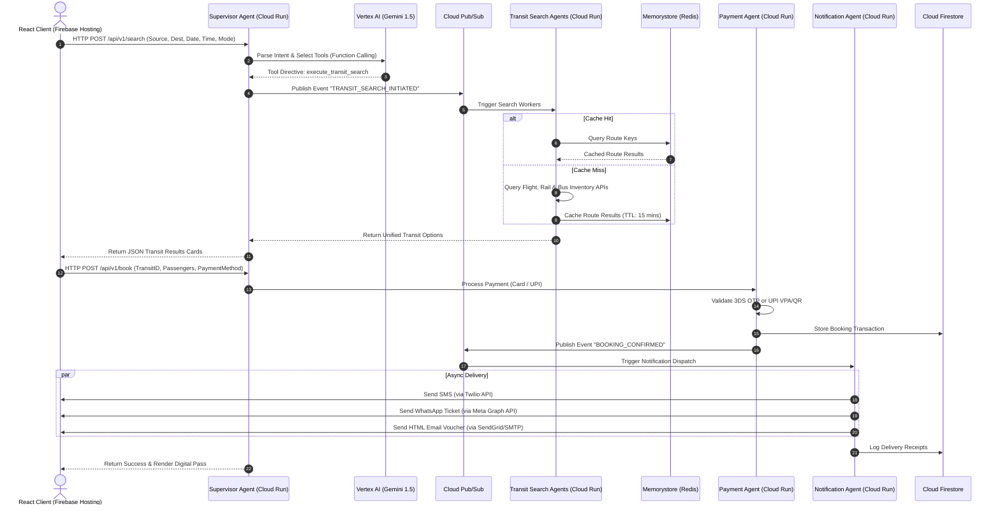

# MyTravelAgent: Full-Stack GCP Technology Architecture

This document specifies the enterprise **Google Cloud Platform (GCP)** technology architecture for **MyTravelAgent**, an autonomous multi-agent travel exploration, multi-modal transit search, payment gateway, and omnichannel notification system.

---

## 1. High-Level GCP System Architecture Diagram

```mermaid
graph TB
    subgraph Client_Layer ["Client & Edge Layer"]
        User([User / Browser / Mobile])
        CDN["Google Cloud CDN & Firebase Hosting"]
        Armor["Google Cloud Armor (WAF & DDoS)"]
        User --> CDN
        CDN --> Armor
    end

    subgraph Compute_and_Agent_Layer ["Multi-Agent Execution Layer (GCP Compute)"]
        Run_Supervisor["Cloud Run Service: Supervisor Agent"]
        Run_Transit["Cloud Run Service: Transit Search Agents (Flight, Train, Bus)"]
        Run_Payment["Cloud Run Service: Payment & Booking Agent"]
        Run_Notif["Cloud Run Service: Omnichannel Notification Agent"]
        
        Armor --> Run_Supervisor
    end

    subgraph AI_and_Orchestration ["AI & Intelligence Engine (Vertex AI)"]
        Vertex_LLM["Vertex AI: Gemini 1.5 Pro / Flash"]
        Vertex_AgentBuilder["Vertex AI Agent Builder (RAG Engine)"]
        
        Run_Supervisor <--> Vertex_LLM
        Run_Supervisor <--> Vertex_AgentBuilder
    end

    subgraph Event_and_Messaging ["Event Streaming & State Management"]
        PubSub["Cloud Pub/Sub Event Bus"]
        Redis["Memorystore for Redis (Transit Cache)"]
        
        Run_Supervisor <--> PubSub
        Run_Transit <--> PubSub
        Run_Payment <--> PubSub
        Run_Notif <--> PubSub
        
        Run_Transit <--> Redis
    end

    subgraph Persistence_and_Secrets ["Database & Security Layer"]
        Firestore["Cloud Firestore / AlloyDB (Bookings & Sessions)"]
        SecretMgr["Secret Manager (API Keys & Tokens)"]
        IAM["Cloud IAM & Firebase Auth"]
        
        Run_Payment <--> Firestore
        Run_Payment <--> SecretMgr
        Run_Notif <--> SecretMgr
    end

    subgraph External_Integrations ["Third-Party & Provider Services"]
        Transit_APIs["Flight, Rail & Bus Inventory APIs"]
        Payment_APIs["Stripe / Razorpay / PhonePe (Card & UPI)"]
        SMS_Gateways["Twilio SMS Gateway"]
        WA_Gateways["Meta WhatsApp Business API"]
        Email_Gateways["SendGrid / Cloud SMTP"]

        Run_Transit <--> Transit_APIs
        Run_Payment <--> Payment_APIs
        Run_Notif --> SMS_Gateways
        Run_Notif --> WA_Gateways
        Run_Notif --> Email_Gateways
    end
```

---

## 2. GCP Component & Service Mapping

| Layer / Function | Recommended GCP Service | Rationale & Configuration |
| :--- | :--- | :--- |
| **Frontend Delivery** | **Firebase Hosting + Cloud CDN** | Serves static assets (React SPA, CSS, SVGs) globally with SSL, edge caching, and zero cold-start latency. |
| **Agent Microservices** | **Cloud Run (Serverless Containers)** | Auto-scaling containerized microservices for Supervisor, Transit, Payment, and Notification agents. Scales from 0 to N instances on demand. |
| **AI Agent Intelligence** | **Vertex AI (Gemini 1.5 Pro / Flash)** | High-speed, long-context LLMs powering agent reasoning, intent parsing, function calling, and structured JSON output generation. |
| **Destination Knowledge Engine** | **Vertex AI Agent Builder / Vector Search** | RAG (Retrieval-Augmented Generation) pipeline indexing destination guides, weather widgets, and POI embeddings. |
| **Agent Event Bus** | **Cloud Pub/Sub** | Asynchronous, decoupled event bus handling high-throughput messaging between agents (`SEARCH_DISPATCH`, `PAYMENT_AUTHORIZED`, `NOTIFICATION_TRIGGER`). |
| **Transit Query Cache** | **Memorystore for Redis** | Sub-millisecond caching of flight, train, and bus route queries to eliminate redundant provider API hits. |
| **Database & Persistence** | **Cloud Firestore** | Serverless NoSQL document database storing user sessions, passenger profiles, ticket reservations, and audit logs. |
| **Secrets & Credentials** | **Secret Manager** | Encrypted vault for storing third-party tokens (Twilio credentials, WhatsApp Meta Tokens, Stripe/Razorpay keys). |
| **Identity & Authentication** | **Firebase Authentication / Identity Platform** | Seamless user sign-in (Google OAuth, Email/Password, Phone OTP) with JWT tokens. |
| **Observability & Logging** | **Cloud Logging & Cloud Trace** | End-to-end distributed tracing across multi-agent calls to monitor agent execution latencies and trace bottlenecks. |

---

## 3. End-to-End GCP Multi-Agent Workflow

---

## 4. Security, Compliance & Resilience

1. **PCI-DSS Compliance for Payments**:
   - No raw credit card credentials or UPI PINs are stored in Firestore. Card tokens and authorization codes are handled via secure payment gateway client SDKs (Stripe / Razorpay).
2. **Identity-Aware Security**:
   - Cloud Run endpoints are protected using Service-to-Service IAM authentication tokens and Cloud Armor rate limiting.
3. **Fault Tolerance & Circuit Breaking**:
   - If an external transit provider API (e.g., train network) experiences downtime, the **Transit Router Agent** uses cached Memorystore data or graceful fallback flags without failing the entire multi-modal search.
